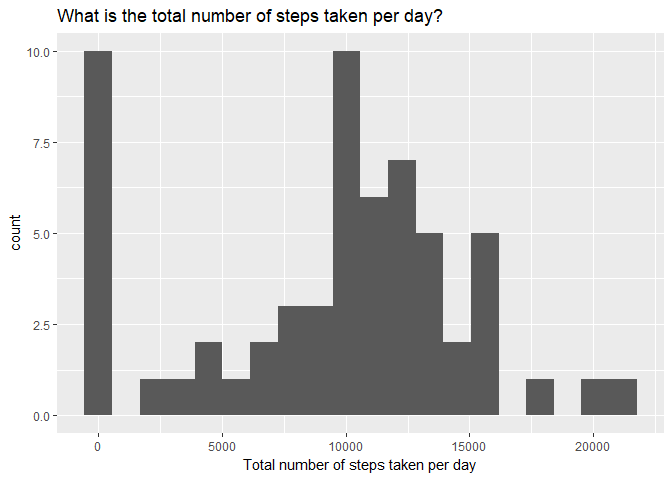
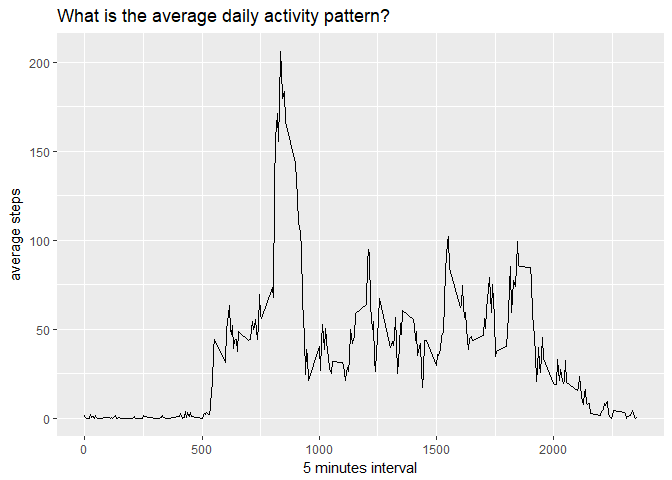
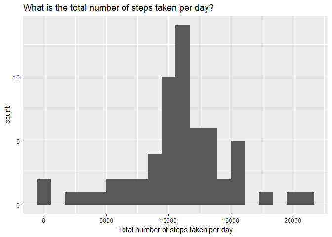
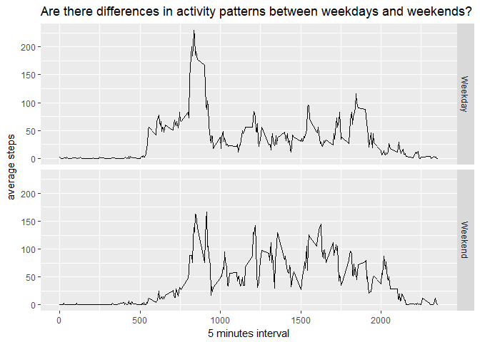

## Loading and preprocessing the data
1. Load the data

```r
# Load some libraries
library(dplyr)
library(ggplot2)

#unzip and read the file
steps<- read.csv(unz("activity.zip", "activity.csv"))
```
2. Process/transform the data

```r
#Convert date to date type
steps$date <- as.Date(steps$date)
```


## What is mean total number of steps taken per day?
1. Calculate the total number of steps taken per day

```r
##create a dataset with the number of steps per day and remove NA
steps_day <-    steps %>% 
                group_by(date) %>% 
                summarise(nbr_steps = sum(steps, na.rm = TRUE))
```

2. Make a histogram of the total number of steps taken each day

```r
#plot a histogram of 20 bins
qplot(  steps_day$nbr_steps, 
        geom="histogram", 
        bins = 20, 
        main="What is the total number of steps taken per day?", 
        xlab="Total number of steps taken per day")
```

<!-- -->

3. Calculate and report the mean and median of the total number of steps taken per day

```r
step_mean <- mean(steps_day$nbr_steps,na.rm = TRUE)
step_median <- median(steps_day$nbr_steps, na.rm = TRUE)
```
The mean of total number of steps taken per day is : ``9354.2295082``

The median of total number of steps taken per day is : ``10395``


## What is the average daily activity pattern?
1. Make a time series plot

```r
# Create dataset grouped by interval and get the mean
steps_interval <-       steps %>% 
                        group_by(interval) %>% 
                        summarise(avg_steps = mean(steps, na.rm = TRUE))
```


```r
#plot a graph
qplot(  data = steps_interval,
        x = interval,
        y = avg_steps,
        geom="line", 
        main="What is the average daily activity pattern?", 
        xlab="5 minutes interval",
        ylab="average steps")
```

<!-- -->
2. interval with maximum number of steps

```r
#get the interval where the number of steps is maximum
step_max <- steps_interval$interval[which.max(steps_interval$avg_steps)]
```
The interval that contains the maximum average steps is : ``835``

## Imputing missing values
1. Calculate and report the total number of missing values in the dataset

```r
nbr_NA <- count(steps[is.na(steps),])
```
The number of NA records is ``2304``


2. Devise a strategy for filling in all of the missing values in the dataset 

The proposition is to fill any NA value with the corresponding average values
for the same interval.   
We can reuse the data created before containing the average steps per interval.  
The idea is to join the datafram steps with steps_interval to get the variable avg_interval.  
For each steps = NA, we fill the value from avg_steps
Then we drop this extra column avg

3. Create a new dataset that is equal to the original dataset but with the missing data filled in

```r
# create data frame that join with step_interval to get the average value, 
# and take value from it if steps is NA, then drop the average column
steps_reshape <-        steps %>% 
                        left_join(steps_interval) %>% 
                        mutate(steps = ifelse(is.na(steps), avg_steps, steps)) %>%
                        select(-"avg_steps")
```

4. Make a histogram of the total number of steps taken each day

```r
##create a dataset with the number of steps per day
steps_day_reshape <-    steps_reshape %>% 
                        group_by(date) %>% 
                        summarise(nbr_steps = sum(steps))
```

```r
#plot a histogram of 20 bins
qplot(  steps_day_reshape$nbr_steps, 
        geom="histogram", 
        bins = 20, 
        main="What is the total number of steps taken per day?", 
        xlab="Total number of steps taken per day")
```

<!-- -->

```r
step_mean_reshape <- mean(steps_day_reshape$nbr_steps)
step_median_rehape <- median(steps_day_reshape$nbr_steps)
```
The new mean of total number of steps taken per day is : ``1.0766189\times 10^{4}``

The new median of total number of steps taken per day is : ``1.0766189\times 10^{4}``


## Are there differences in activity patterns between weekdays and weekends?

1. Create a new factor variable in the dataset with two levels - "weekday" and "weekend" indicating whether a given date is a weekday or weekend day.

```r
steps_weekdays <-       steps_reshape %>% 
                        mutate(weekday = ifelse(grepl("S(at|un)", weekdays(date)), "Weekend", "Weekday"))
```

2. Make a panel plot containing a time series plot

```r
#create dataset by grouping by weekday and interval
steps_weekdays <-       steps_weekdays %>%
                        group_by(weekday, interval) %>%
                        summarize(avg_steps = mean(steps))
```

```r
#plotting the averate by for weekday and weekend
qplot(  data = steps_weekdays,
        x = interval,
        y = avg_steps,
        facets = weekday ~ .,
        geom="line", 
        main="Are there differences in activity patterns between weekdays and weekends?", 
        xlab="5 minutes interval",
        ylab="average steps")
```

<!-- -->
